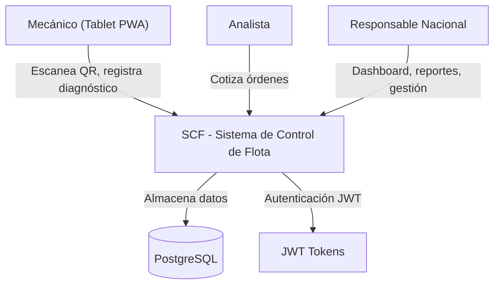
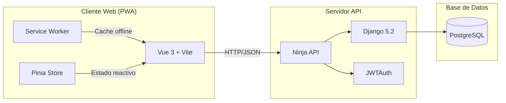

# Arquitectura del Sistema — SCF

## 1. Diagrama de Contexto (C1)

## 2. Diagrama de Contenedores (C2)

### Stack Tecnológico

| Capa | Tecnología | Versión |
|---|---|---|
| Backend | Python / Django + Ninja | 3.11+ / 5.2 |
| Autenticación | django-ninja-jwt | 5.4.4 |
| Frontend | Vue 3 + Pinia + Vue Router | 3.5 / 3.0 / 5.1 |
| UI | PrimeVue 4 + PrimeIcons + PrimeUI Themes | 4.5 / 7.0 / 4.5 |
| PWA | vite-plugin-pwa (manifest + SW shell; offline lógico planificado) | 1.3 |
| Build tool | Vite | 8.0 |
| Gráficas | Chart.js | 4.5 |
| CSS | Tailwind CSS 4 + tailwindcss-primeui | 4.3 / 0.6 |
| BD Producción | PostgreSQL | 15+ |
| BD Desarrollo | SQLite (fallback) | — |
| Linting | Ruff (backend) + ESLint/Prettier (frontend) | — |

## 3. Modelo de Datos

El DER, diccionario de datos, reglas de negocio y matriz RBAC se encuentran en [`docs/database.md`](database.md).

Documentación interactiva de la API: `/api/docs` (Swagger UI, generado por Django Ninja).

## 4. Decisiones Técnicas (ADRs)

| # | Decisión | Opciones | Elegido | Contexto |
|---|---|---|---|---|
| 1 | Framework API | DRF vs **Django Ninja** | Django Ninja | Tipado nativo con Pydantic, OpenAPI automático, mejor rendimiento |
| 2 | Autenticación JWT | Custom vs **django-ninja-jwt** | django-ninja-jwt | Elimina código manual de JWT, refresh tokens, mantenido oficialmente |
| 3 | Config BD | Regex manual vs **dj-database-url** | dj-database-url | Estandariza el parsing de DATABASE_URL, menos propenso a errores |
| 4 | Frontend Framework | Options API vs **Composition API** | Composition API | Mejor tree-shaking, reutilización de lógica con composables |
| 5 | UI Components | Bootstrap vs **PrimeVue** | PrimeVue | Componentes específicos para DataTable, menús, formularios corporativos |
| 6 | Estado Global | Vuex vs **Pinia** | Pinia | Oficial para Vue 3, mejor soporte TypeScript, setup stores |
| 7 | Linting Backend | flake8 + black vs **Ruff** | Ruff | 10-100x más rápido, unifica lint + formato, compatible con pyproject.toml |
| 8 | Gestión de Dependencias | pip + requirements.txt vs **uv** | uv | Resolución 10-100x más rápida, lockfile determinista (`uv.lock`) |
| 9 | CRUD factory | Repetitivo manual vs **register_crud + CrudConfig** | CrudConfig | Elimina ~435 líneas duplicadas de 12 endpoints de catálogos/organización; centraliza validaciones FK y soft-delete |
| 10 | UniqueConstraint condicional | `unique_together` vs **UniqueConstraint(condition=Q(estatus_activo=True))** | Conditional UniqueConstraint | Permite reciclar nombres de registros soft-deleteados sin IntegrityError; todos los catálogos y organización lo usan. Vehículo mantiene `unique=True` en `numero_economico`, `vin`, `numero_unidad` (identificadores reales únicos permanentemente) |

## 5. Requerimientos No Funcionales (NFRs)

- **NFR-01 — Disponibilidad y Tolerancia a Fallos (Offline-First):** 🚧 Planificado (no implementado). La interfaz del mecánico en tablet debe ser una PWA capaz de registrar diagnósticos sin conectividad, almacenando en IndexedDB y sincronizando automáticamente. `vite-plugin-pwa` está en dependencias pero aún no hay lógica offline (Service Worker, sincronización diferida, caché de catálogos).

- **NFR-02 — Integridad y Veracidad de Datos:** El sistema implementa `unique=True` en `numero_economico`, `vin` y `numero_unidad` para impedir duplicidades a nivel nacional. La combinación `placa + color_placa` utiliza `UniqueConstraint` condicional. Los formularios del taller deben restringir la entrada de texto libre para fallas comunes, garantizando data estructurada.

- **NFR-03 — Rendimiento y Velocidad de Respuesta:**
    - Los endpoints críticos de la API deben responder en menos de 400ms bajo condiciones normales de red.
    - El flujo de escaneo QR y carga de la Ficha Técnica no debe superar los 2 segundos totales en pantalla.

- **NFR-04 — Seguridad y Cifrado:** Toda comunicación viaja bajo HTTPS. Las contraseñas se almacenan con hash seguro (PBKDF2/Argon2 nativos de Django). La autenticación se realiza mediante JWT (django-ninja-jwt) con acceso + refresh token. CORS configurado para el origen del frontend.
