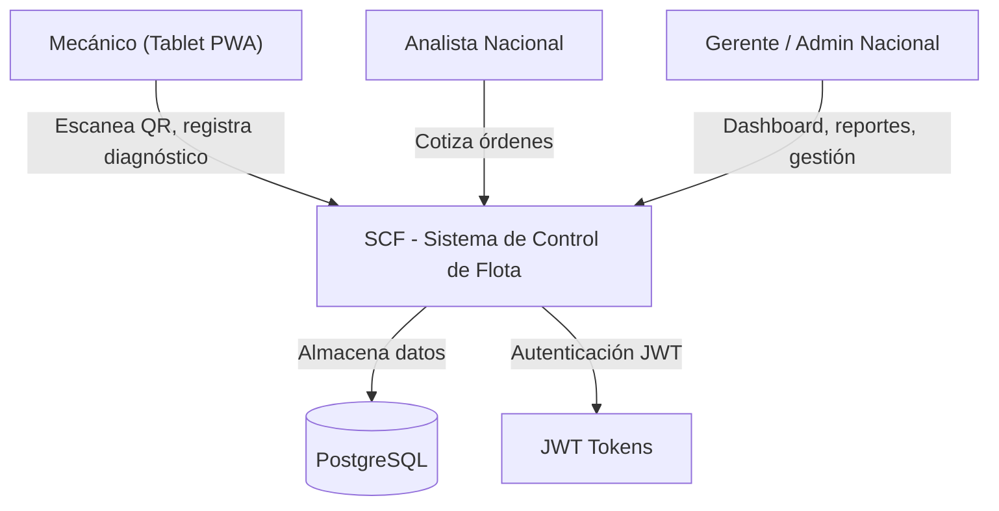
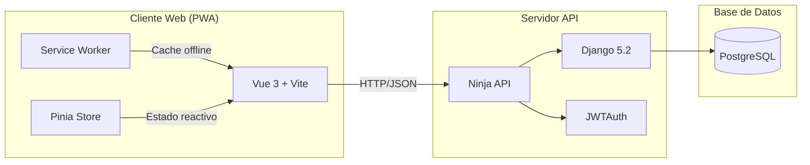
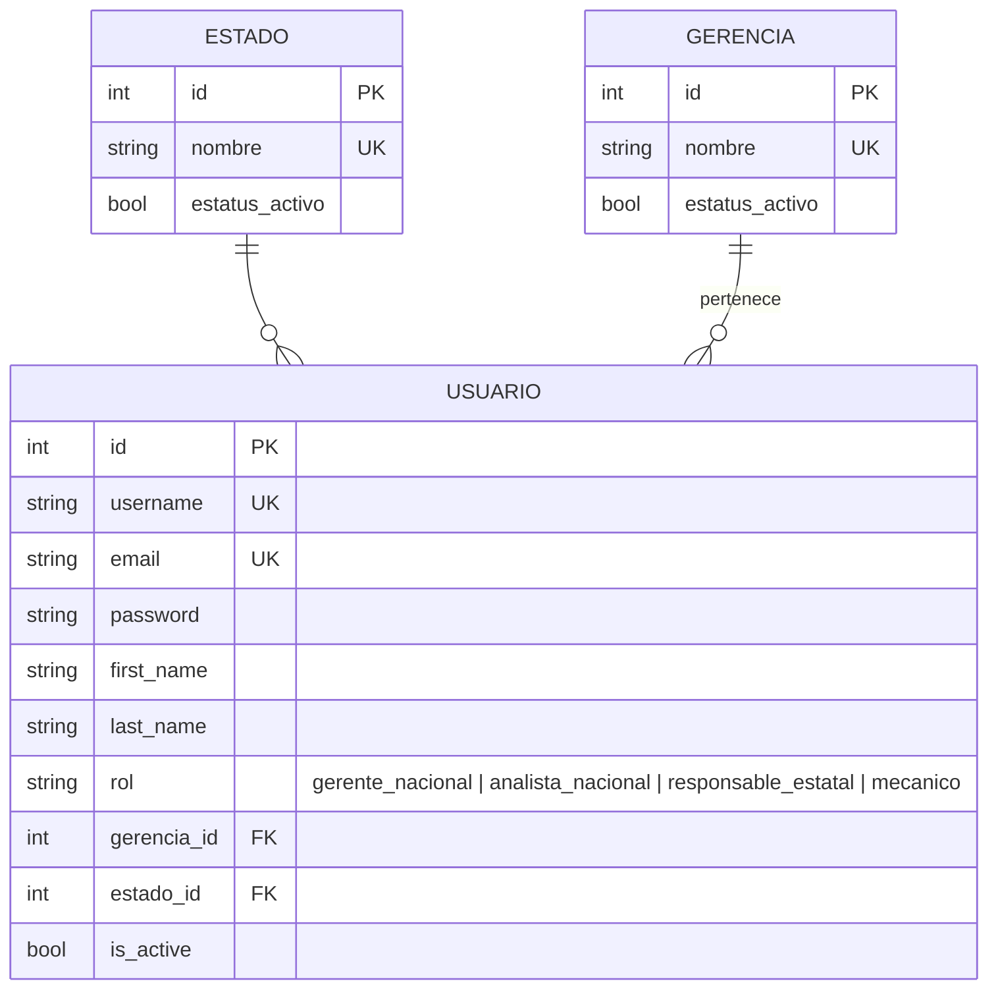
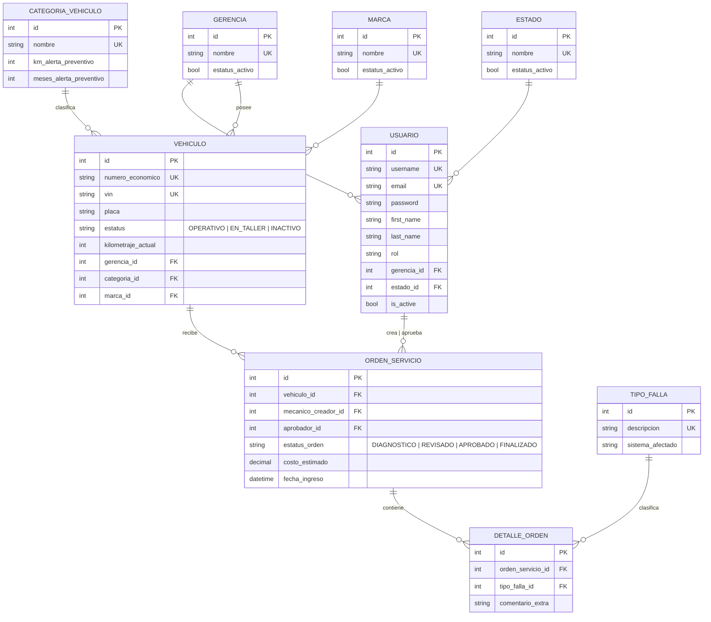

# Arquitectura del Sistema — SCF

## 1. Diagrama de Contexto (C1)

## 2. Diagrama de Contenedores (C2)

### Stack Tecnológico

| Capa | Tecnología | Versión |
|---|---|---|
| Backend | Python / Django + Ninja | 3.11+ / 5.2 |
| Autenticación | django-ninja-jwt | 5.4.4 |
| Frontend | Vue 3 + Pinia + Vue Router | 3.5 / 3.0 / 5.1 |
| UI | PrimeVue 4 + PrimeIcons | 4.5 / 7.0 |
| PWA | vite-plugin-pwa | 1.3 |
| BD Producción | PostgreSQL | 15+ |
| BD Desarrollo | SQLite (fallback) | — |
| Linting | Ruff (backend) + ESLint/Prettier (frontend) | — |

## 3. Diagrama Entidad-Relación (DER)

### 3.1 Modelo Actual

### 3.2 Modelo Completo (Actual + Planificado)

### 3.3 Estatus de Implementación

| Entidad | Estado | App |
|---|---|---|
| `Estado` | ✅ Implementado | organizacion |
| `Gerencia` | ✅ Implementado | organizacion |
| `Usuario` | ✅ Implementado | usuarios |
| `Vehiculo` | 🚧 Planificado | — |
| `OrdenServicio` | 🚧 Planificado | — |
| `DetalleOrden` | 🚧 Planificado | — |
| `Marca` | 🚧 Planificado | — |
| `CategoriaVehiculo` | 🚧 Planificado | — |
| `TipoFalla` | 🚧 Planificado | — |

## 4. APIs

| Ruta | Método | Descripción | Auth |
|---|---|---|---|
| `/api/auth/login` | POST | Inicio de sesión (username o email) | None |
| `/api/auth/refresh` | POST | Renovar access token | None |
| `/api/auth/me` | GET | Perfil del usuario autenticado | JWT |
| `/api/usuarios/` | GET | Listar usuarios | JWT + gerente_nacional |
| `/api/usuarios/` | POST | Crear usuario | JWT + gerente_nacional |
| `/api/usuarios/{id}` | PUT | Actualizar usuario | JWT + gerente_nacional |
| `/api/usuarios/{id}` | DELETE | Desactivar usuario | JWT + gerente_nacional |
| `/api/organizacion/estados/` | GET | Listar estados activos | JWT |
| `/api/organizacion/gerencias/` | GET | Listar gerencias activas | JWT |

Documentación interactiva: `/api/docs` (Swagger UI, generado por Django Ninja).

## 5. Decisiones Técnicas (ADRs)

| # | Decisión | Opciones | Elegido | Contexto |
|---|---|---|---|---|
| 1 | Framework API | DRF vs **Django Ninja** | Django Ninja | Tipado nativo con Pydantic, OpenAPI automático, mejor rendimiento |
| 2 | Autenticación JWT | Custom vs **django-ninja-jwt** | django-ninja-jwt | Elimina código manual de JWT, refresh tokens, mantenido oficialmente |
| 3 | Config BD | Regex manual vs **dj-database-url** | dj-database-url | Estandariza el parsing de DATABASE_URL, menos propenso a errores |
| 4 | Frontend Framework | Options API vs **Composition API** | Composition API | Mejor tree-shaking, reutilización de lógica con composables |
| 5 | UI Components | Bootstrap vs **PrimeVue** | PrimeVue | Componentes específicos para DataTable, menús, formularios corporativos |
| 6 | Estado Global | Vuex vs **Pinia** | Pinia | Oficial para Vue 3, mejor soporte TypeScript, setup stores |
| 7 | Linting Backend | flake8 + black vs **Ruff** | Ruff | 10-100x más rápido, unifica lint + formato, compatible con pyproject.toml |
| 8 | Gestión de Dependencias | pip + requirements.txt vs **uv** | uv | Resolución 10-100x más rápida, lockfile determinista (`uv.lock`) |
