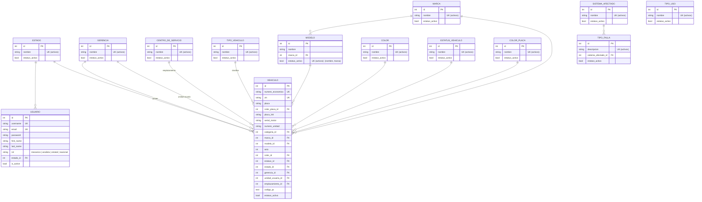
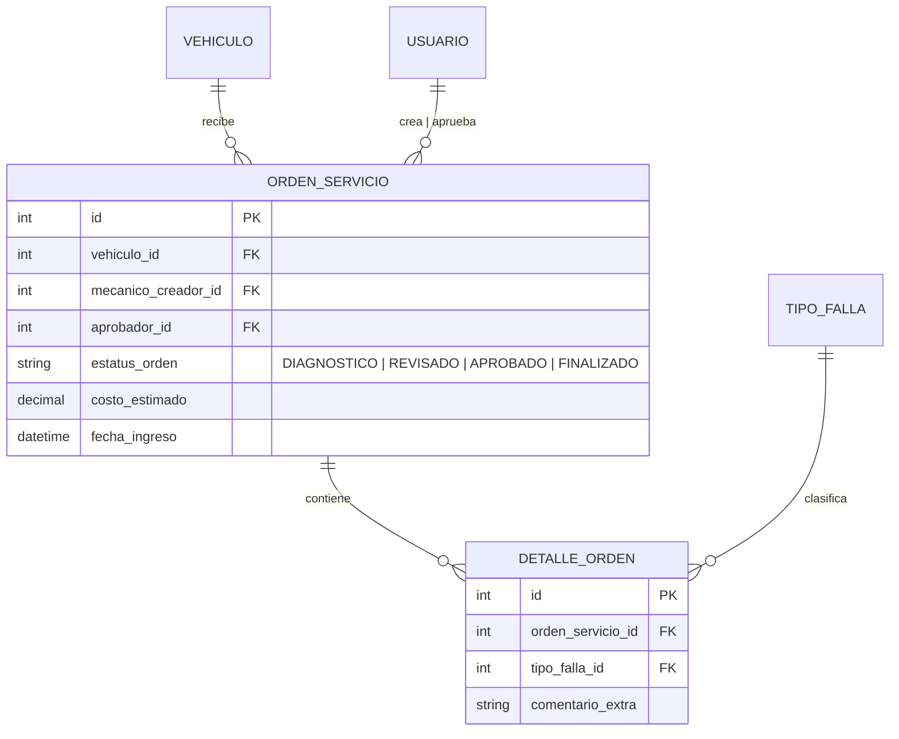

# Base de Datos — SCF

## Diagrama Entidad-Relación (DER)

### Planificado (próximas iteraciones)

## Diccionario de Datos

### Estado, Gerencia y CentroDeServicio

| Modelo | App | Campos | Notas |
|---|---|---|---|
| `Estado` | organizacion | `id`, `nombre` (UK), `estatus_activo` | Entidad independiente (sin FK a Gerencia) |
| `Gerencia` | organizacion | `id`, `nombre` (UK), `estatus_activo` | Entidad independiente (sin FK a Estado) |
| `CentroDeServicio` | organizacion | `id`, `nombre` (UK), `estatus_activo` | Entidad independiente |

### Usuario

| Campo | Tipo | Restricciones | Descripción |
|---|---|---|---|
| `id` | BigAutoField | PK | Identificador interno |
| `username` | CharField | UK | Heredado de AbstractUser |
| `email` | EmailField | UNIQUE | Correo corporativo |
| `password` | CharField | — | Hash Argon2/PBKDF2 (Django) |
| `first_name` | CharField | — | Nombre |
| `last_name` | CharField | — | Apellido |
| `rol` | CharField(25) | Choices | `mecanico`, `analista`, `estatal`, `nacional` |
| `estado` | ForeignKey(Estado) | NULL, BLANK, SET_NULL | Estado de asignación. Nulo solo si rol es `nacional` |
| `is_active` | BooleanField | — | Heredado de AbstractUser |
| `is_staff`, `date_joined`, etc. | — | — | Heredado de AbstractUser |

### Vehículo

| Campo | Tipo | Restricciones | Descripción |
|---|---|---|---|
| `id` | BigAutoField | PK | |
| `numero_economico` | CharField(50) | UNIQUE | ID interno. Único nacional. |
| `vin` | CharField(17) | UNIQUE | Serial de chasis. Único nacional. |
| `numero_unidad` | CharField(50) | UNIQUE, NULL | Número alterno de unidad. |
| `placa` | CharField(20) | NULL, BLANK | Matrícula gubernamental. |
| `color_placa` | FK(ColorPlaca) | NULL, BLANK | Color de la placa. |
| `placa_intt` | CharField(20) | BLANK | Placa INTT. |
| `serial_motor` | CharField(50) | BLANK | Serial del motor. |
| `anio` | IntegerField | — | Año. |
| `marca` | FK(Marca) | RESTRICT | |
| `modelo` | FK(Modelo) | RESTRICT | |
| `categoria` | FK(TipoVehiculo) | RESTRICT | Tipo/categoría. |
| `color` | FK(Color) | NULL, BLANK | |
| `estatus` | FK(EstatusVehiculo) | RESTRICT | Estatus operativo. |
| `estado` | FK(Estado) | RESTRICT | Estado donde opera. |
| `gerencia` | FK(Gerencia) | RESTRICT | Gerencia propietaria. |
| `unidad_usuaria` | FK(Gerencia) | NULL, BLANK | Gerencia usuaria. |
| `emplazamiento` | FK(CentroDeServicio) | RESTRICT | Centro de servicio. |
| `codigo_qr` | TextField | BLANK | QR en base64 (autogenerado). |
| `estatus_activo` | BooleanField | Default: True | Soft-delete. |

**Constraints (condicionales a `estatus_activo=True`):**
- `UniqueConstraint(numero_economico)` — número económico único entre activos.
- `UniqueConstraint(vin)` — VIN único entre activos.
- `UniqueConstraint(numero_unidad)` — número de unidad único entre activos (nullable, permite múltiples NULL).
- `UniqueConstraint(placa, color_placa)` — una placa no puede repetirse en el mismo color entre activos.

Los catálogos y organización usan el mismo patrón: toda `UNIQUE` es condicional `WHERE estatus_activo = 1`, permitiendo reciclar nombres/valores de registros soft-deleteados sin violar integridad.

### Catálogos (9 modelos)

Nota: Todos los `UNIQUE` son condicionales a `estatus_activo=True` mediante `UniqueConstraint` con `condition=Q(estatus_activo=True)`. Esto permite reciclar nombres de registros soft-deleteados.

| Modelo | App | Campos | FK | UniqueConstraint (condicional) |
|---|---|---|---|---|
| `Marca` | catalogos | `id`, `nombre`, `estatus_activo` | — | `nombre` |
| `Modelo` | catalogos | `id`, `nombre`, `marca_id`, `estatus_activo` | Marca | `(nombre, marca)` |
| `TipoVehiculo` | catalogos | `id`, `nombre`, `estatus_activo` | — | `nombre` |
| `TipoUso` | catalogos | `id`, `nombre`, `estatus_activo` | — (huérfano, sin FK) | `nombre` |
| `Color` | catalogos | `id`, `nombre`, `estatus_activo` | — | `nombre` |
| `SistemaAfectado` | catalogos | `id`, `nombre`, `estatus_activo` | — | `nombre` |
| `EstatusVehiculo` | catalogos | `id`, `nombre`, `estatus_activo` | — | `nombre` |
| `ColorPlaca` | catalogos | `id`, `nombre`, `estatus_activo` | — | `nombre` |
| `TipoFalla` | catalogos | `id`, `descripcion`, `sistema_afectado_id`, `estatus_activo` | SistemaAfectado | `descripcion` |

## Reglas de Negocio

- **BR-01 (Unicidad):** `numero_economico`, `vin` y `numero_unidad` deben ser únicos a nivel nacional.
- **BR-02 (Placa+Color):** Una combinación `placa` + `color_placa` no puede duplicarse.
- **BR-03 (Jerarquía de aprobación):** `mecanico` diagnostica → `analista` cotiza → `estatal`/`nacional` aprueba. *(Planificado)*
- **BR-04 (Scope por Estado):** Roles `estatal`, `analista` y `mecanico` solo ven datos de su Estado. `nacional` ve todo.

## Estatus de Implementación

| Entidad | Estado | App |
|---|---|---|
| `Estado` | ✅ Implementado | organizacion |
| `Gerencia` | ✅ Implementado | organizacion |
| `CentroDeServicio` | ✅ Implementado | organizacion |
| `Usuario` | ✅ Implementado | usuarios |
| `Marca` | ✅ Implementado | catalogos |
| `Modelo` | ✅ Implementado | catalogos |
| `TipoVehiculo` | ✅ Implementado | catalogos |
| `TipoUso` | ✅ Implementado | catalogos |
| `Color` | ✅ Implementado | catalogos |
| `SistemaAfectado` | ✅ Implementado | catalogos |
| `EstatusVehiculo` | ✅ Implementado | catalogos |
| `ColorPlaca` | ✅ Implementado | catalogos |
| `TipoFalla` | ✅ Implementado | catalogos |
| `Vehiculo` | ✅ Implementado | vehiculos |
| `OrdenServicio` | 🚧 Planificado | — |
| `DetalleOrden` | 🚧 Planificado | — |

## Matriz de Permisos (RBAC)

| Caso de Uso | nacional | analista | estatal | mecanico |
|---|---|---|---|---|
| Gestionar Usuarios | ✅ CRUD | ❌ | ❌ | ❌ |
| Gestionar Estado/Gerencia/Centro | ✅ CRUD | ❌ | ❌ | ❌ |
| Gestionar Catálogos | ✅ CRUD | ❌ | ❌ | ❌ |
| CRUD Vehículos | ✅ CRUD | ❌ | ❌ | ❌ |
| Ver Ficha Técnica (QR) | ✅ Todo | ✅ Su Estado | ✅ Su Estado | ✅ Su Estado |
| Generar Diagnóstico (Taller) | 🚧 | ❌ | ❌ | 🚧 |
| Cotizar / Aprobar OS | 🚧 | 🚧 | 🚧 | ❌ |
| Dashboard | 🟡 Skeleton | 🟡 Skeleton | 🟡 Skeleton | ❌ |
| Reportes | 🚧 | 🚧 | ❌ | ❌ |
